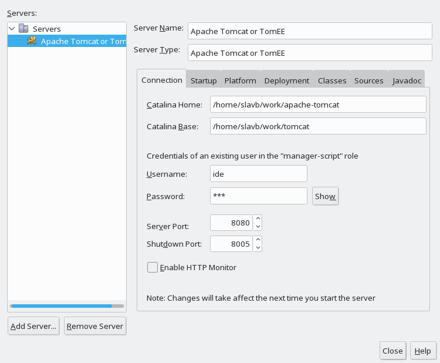

# Тестовое задание по java

1) форкнуть https://github.com/ilb/jparestresource
2) Создать базу в mysql сервере (см. schema.sql)
3) Запустить приложение
4) добавить данные в БД (скриптом /jparestresource-web/src/test/resources/test/createDocumentBatchJson.sh)
5) доработать метод DocumentsResourceImpl.createBatch(Documents documents), 
чтобы исполнение скрипта (/jparestresource-web/src/test/resources/test/createDocumentBatchXml.sh) отрабатывало правильно 
6) реализовать метод DocumentsResourceImpl.create(Document document), проверить на срипте /jparestresource-web/src/test/resources/test/createDocumentXml.sh
7) описать в модели jparestresource-web/src/main/resources/META-INF/model.jpa новую сущность user с полями displayName (ФИО пользователя). Описать связку  M:1 document -> user
(как пользоваться jeddict см. https://jeddict.github.io/)
8) Описать представление новой сущности в view.xsd. (и в представление document добавить ссылку на user). 
Написать маппер для User (/jparestresource-web/src/main/java/ru/ilb/jparestresource/mappers/UserMapper.java) (как писать см. http://mapstruct.org/)
Добавить в xml /jparestresource-web/src/test/resources/test/createDocumentBatchXml.xml двух тестовых user'ов. Один будет относится к первой половине документов, второй - к оставшимся.
Проверить, запуском скрипта /jparestresource-web/src/test/resources/test/createDocumentBatchXml.sh, что в БД были добавлены эти 2 user'a.

## Установка и настройка Netbeans

### Установка
1. [Скачать Netbeans 8.2](https://netbeans.org/downloads/), выбрать "Все" (полную версию)
2. Распаковать файлы: unzip netbeans-X.Y.Z-YYYYMMDDXXXX.zip -d /opt или в %ProgramFiles%\Netbeans

### Настройка

#### Настройки в файле конфигурации netbeans.conf

На Windows: В строку netbeans_default_options добавить -J-Dfile.encoding=UTF-8 (на linux UTF-8 берется из локали). Так же нужно в переменные среды добавить JAVA_TOOL_OPTIONS=-Dfile.encoding=UTF-8

Переключаем интерфейс на английский - так привычнее : в netbeans_default_options добавить --locale en_US 

## Установка и подключение Tomcat

Установка вручную: [скачать](http://apache-mirror.rbc.ru/pub/apache/tomcat/tomcat-9/v9.0.13/bin/apache-tomcat-9.0.13.tar.gz) и распаковать.

Подключение: 

Tools - Servers - Add server - Choose Server - Tomcat - Catalina Home - указать каталог с Tomcat. 

Для отладки удобно иметь свою конфигурацию сервера - крыжим Use Private Configuration Folder, 
указываем на пустой каталог (создать можно прямо из диалога выбора каталога). Заполняем имя и пароль пользователя, например ide и 123, этот пользователь будет использован для управления данным экземпляром Tomcat.

## Установка Jeddict

[Скачать или установить через Update Center версия 5.2 для netbeans 8.2](https://jeddict.github.io/page.html?l=p/download)
